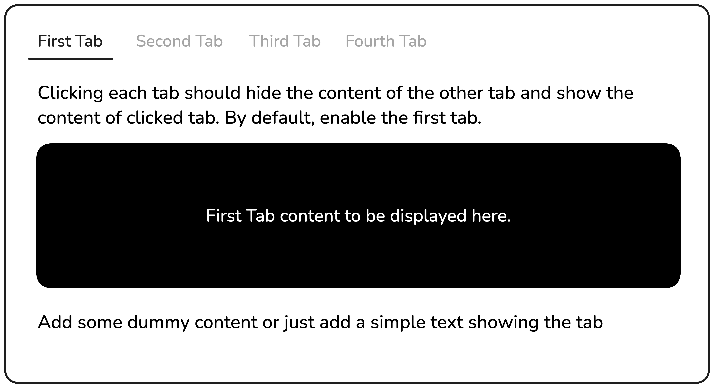

# Tabs

[Live Demo](https://anaid-ariwany.github.io/Roadmap.sh-Frontend-Projects/Tabs/)

This project is designed to introduce you to basic DOM manipulation and event handling in JavaScript.

You are required to create a simple tab functionality using HTML, CSS, and basic JavaScript. The page will have four tabs, with the first tab being active by default. When the user clicks on another tab, the content of the current tab will be hidden, and the content of the selected tab will be displayed.

### Desired Outcome

### Learning Outcome
This project will help you practice selecting elements with JavaScript, listening for click events, and manipulating the DOM to show or hide relevant tab content.

**_Source:_** https://roadmap.sh/projects/simple-tabs